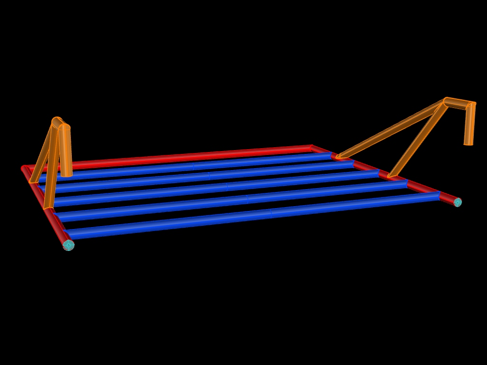

# Towel rail for shower cabin
Towel rail for shower cabin. Created with Rhino 6.

Here i have a small project. I designed a towel rail for my shower.
We have had some cheap one's in the past couple of years. Every single one failed somedays
because of unapropriate using force against the tiny wire rod's by pulling towels from it.

That's way i designed my one one and let it build by a small metal construction company.

## Towel Rail

The construction consist of a bunch of 12 x 0,3 mm V4A stainless steel pipes, welded together. 
Two suction cups with a build in 4mm M4 screw are mounted on the underside against the glass. 

 
 
 
 
